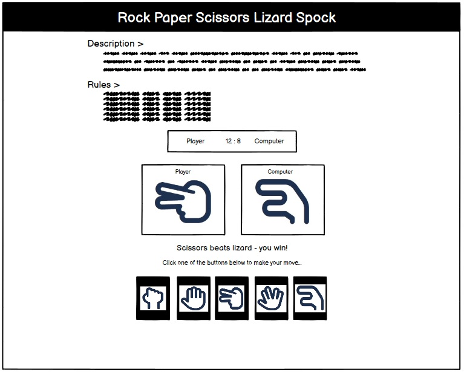
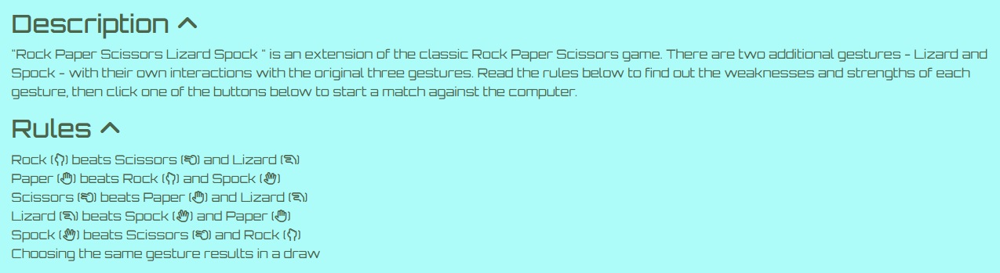

# Rock Paper Scissors Lizard Spock

## Project Description [UPDATE REQUIRED]
Rock Paper Scissors Lizard Spock (RPSLS) is an extension of the classic game, "Rock Paper Scissors" - the addition of two new symbols, Lizard and Spock, and their respective rules, make winning outcomes more likely! 

This application will allow the user to play games of RPSLS against the computer which will pick one of the five symbols randomly to play against you. It's a great way to learn how the game works and have a truly random opponent - versus other humans who might have preferences, or strategies.

The application is great for someone looking to learn about the original Rock Paper Scissors game and impress others with their knowledge about this extended version. With the addition of the stats table, it can also help users develop their understanding of probability, or compete to get the highest score or winstreak. It might even be able to help users figure out their "lucky" gesture!

 

## Project Principles [UPDATE REQUIRED]
1. **Mobile-first development:** The website has been designed with responsiveness in mind. All elements and structures were first created to fit mobile screens, with additional styling and classes to ensure responsiveness on larger screens. This is particularly important with a small and simple application such as this, as it is well suited for mobile interaction. 
2. **Accessibility:** Code used within the project is compliant with best practice for accessibility. The application is also intentionally designed to utilise icons over images which will ensure rapid loading.

## Wireframes
Balsamiq Wireframes software was used during the planning process to establish a general structure the game page. 

Significant changes between the structure indicated in the wireframes versus the end product include:
- The wireframes are B&W - colour scheme was decided on and implemented at a later stage.
- The final version includes a table of stats below the game area screen which had not been designed at the wireframing stage. 

**Mobile**  

**Tablet**  

**Laptop+**  

## Features

### Existing Features
#### 1. Header
Simple header section containing the title of the project and laying out the primary font and colour scheme for the rest of the page.

**Smaller screens (mobile, small tablet, up to 576px)**  
  

**Larger screens (tablet, laptop, 768px+)**  
  

#### 2. Information Area - game description and rules
The information area contains two sections, one for a description of the game and another displaying the rules (i.e. conditions for winning, losing and drawing).
Both sections are displayed by default but can be collapsed by clicking their respective header, and this is indicated by the arrow icon next to each. 

**Smaller screens (mobile, small tablet, up to 576px)**  
  

**Larger screens (tablet, laptop, 768px+)**  
  

#### 3. Game Outcome Area
The game outcome area is featured centrally within the screen since this is the most visually active section for the user to keep track of. The outcome area includes several elements including the score counter, the visual display of the game's outcome, and a message outputting the choices and outcome of the game verbally.

Custom CSS styling is used to keep size of the elements, fonts etc. in the outcome area small for mobile screens and larger for laptop screens and up, but the layout of the area remains consistent. 

**Smaller screens (mobile, small tablet, up to 576px)**  
  

**Larger screens (tablet, laptop, 768px+)**  
  

#### 4. Game area
The game area includes two elements. The first is the call to action, telling the user how to start a game. The second is a row of buttons corresponding to the different gestures that can be played by the user - this is indicated graphically with icons. Upon clicking one of the buttons, the game instance will run and the outcome will immediately be displayed in the Game Outcome Area described above.

**Smaller screens (mobile, small tablet, up to 576px)**  
  

**Larger screens (tablet, laptop, 768px+)**  
  

#### 6. Stats Area [UPDATE REQUIRED]
Stats area info here
**Up to 992px**  

**Over 992px**  

### Features to implement
1. **Development of "Stats" section:** The stats table is functional but could be expanded/improved in several ways:
- Calculate and display in table (adding columns where needed) additional stats e.g. individual win-rates for each specific gesture; loss/draw streaks
- Create graphs or charts comparing winrate of user's choices
- Could also display stats for the computer's choices
- Develop a function to track and display your "best" gesture, taking winrate into consideration. Could require minimum 10 games played to drive up user engagement.

2. **"Reset" button:** This would be a minor quality of life improvement to allow the user to reset all stats and counters on the page, and clear the outcome display boxes and messages, without having to refresh the page. This would be relatively easy to implement with a single function in script.js to target elements in the DOM to set back to 0. 

## Testing
Testing was conducted throughout the development cycle of the project, using the deployed version of the website as this was deployed at a very early stage. DevTools was utilised extensively to facilitate the testing of the site's responsiveness on different screen sizes (phone, tablet, laptop, desktop) in accordance with industry standard breakpoints (https://getbootstrap.com/docs/5.3/layout/breakpoints/#available-breakpoints).

Both manual testing and validator testing were used to identify potential bugs and inefficiencies in the project code.
 
### Manual Testing
I confirmed through manual testing that the page is responsive on all screen sizes and operates correctly on different browsers such as Chrome, Edge and Safari.

Bugs resolved during manual testing:
- Noticed that the outcome message did not appear capitalised as the `playerChoice` parameter will always be lower case. This was resolved by applying a string method to pull out the first letter in the string, capitalising it, concatenating with the remaining string and and assigning this to a new variable. 
`let playerChoiceCapitalised = playerChoice[0].toUpperCase() + playerChoice.slice(1,);`
- Despite using the `.toFixed(2)` math method on the winrate, I was sometimes seeing recurring numbers after the decimal point. This was resolved by splitting the code over two lines and applying the math method separately and assigning to a new variable.  
`let roundedTotalWinrate = Math.round(totalWinrate*100);`
- Identified several minor text/label alignment issues in the outcome area which were resolved with amendments to custom CSS.

### Automated Testing [UPDATE REQUIRED]
Lighthouse testing was conducted on the deployed page with the following results.

During lighthouse testing of the booking form page, an accessibility issue was identified - specifically, the contrast between the labels and background was not high enough for normal text. This was resolved by lightening the secondary colour, creating greater contrast. Upon retesting with lighthouse in the same section, the issue was seen to be resolved. 

**Lighthouse testing results** 

### Validator Testing [UPDATE REQUIRED]

#### HTML
Homepage: No errors.

#### CSS
No bugs reported.
5 warnings were reported. 
  
10 - Highlights Google Fonts library as external so cannot be checked, can be safely ignored  
24 - Pertains to use of CSS variables, can be safely ignored  
29 - Pertains to use of CSS variables, can be safely ignored  
102 - Result from autoprefixer, can be safely ignored  
103 - Result from autoprefixer, can be safely ignored  

Since none of the warnings were unexpected or any cause for concern, no action was taken to resolve these. 

#### JS

### Unfixed Bugs
- All bugs found were resolved.

### Deployment
The site was deployed to GitHub pages. The steps to deploy are as follows:
- In the GitHub repository, navigate to the Settings tab.
- From the source section drop-down menu, select the Master Branch.
- Once the master branch has been selected, the page will be automatically refreshed with a detailed ribbon display to indicate the successful deployment.

The direct link to the deployed page can be found here - https://dtt2411.github.io/CI-Portfolio-Project-2/.

## Credits [UPDATE REQUIRED]

### Concept
I used Project Example Idea 1 recommended within Code Institute's Portfolio Project 2 Assessment Guide: https://learn.codeinstitute.net/courses/course-v1:CodeInstitute+JSE_PAGPPF+2021_Q2/courseware/30137de05cd847d1a6b6d2c7338c4655/c3bd296fe9d643af86e76e830e1470dd/

### Content
- Bootstrap structures (e.g. table, collapsible) and classes (e.g. text-center, text-md-start) were used to improve efficiency of html and css respectively. One bootstrap JS script was also used to provide functionality for the collapsible text content in the game information area. https://getbootstrap.com/docs/5.3/getting-started/introduction/.
- Google Fonts for custom fonts used throughout site. Link to embed code used: https://fonts.googleapis.com/css2?family=Jockey+One&family=Orbitron:wght@400..900&display=swap.
- Browser favicons were identified and downloaded from https://www.flaticon.com/. A Favicon converter (https://favicon.io/favicon-converter/) was used to create appropriately sized icons for different screen sizes.
- Icolour pallete (https://icolorpalette.com/palette-by-themes/ski) and Coolors (https://coolors.co/) were used for inspiration for colour schemes. 
- Amiresponsive (https://ui.dev/amiresponsive) was used to generate the mock-up image for the readme. 
- Balsamiq Wireframes (https://balsamiq.com/) was used extensively during planning to guide the structure and layout of the website. 
- W3C HTML Validator (https://validator.w3.org/#validate_by_input) was utilised extensively during testing.
- W3C CSS Validator (https://jigsaw.w3.org/css-validator/#validate_by_input) was also used during testing.
- Autoprefixer (https://autoprefixer.github.io/) was used to ensure portability of styles across different browsers. 
- Used contrast checker (https://webaim.org/resources/contrastchecker/) to check the viability of the colour scheme. 

### Media
- Font Awesome for iconography, link to personal kit: https://kit.fontawesome.com/3af9805755.js 